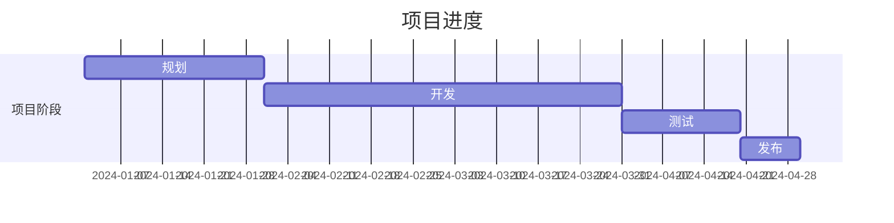
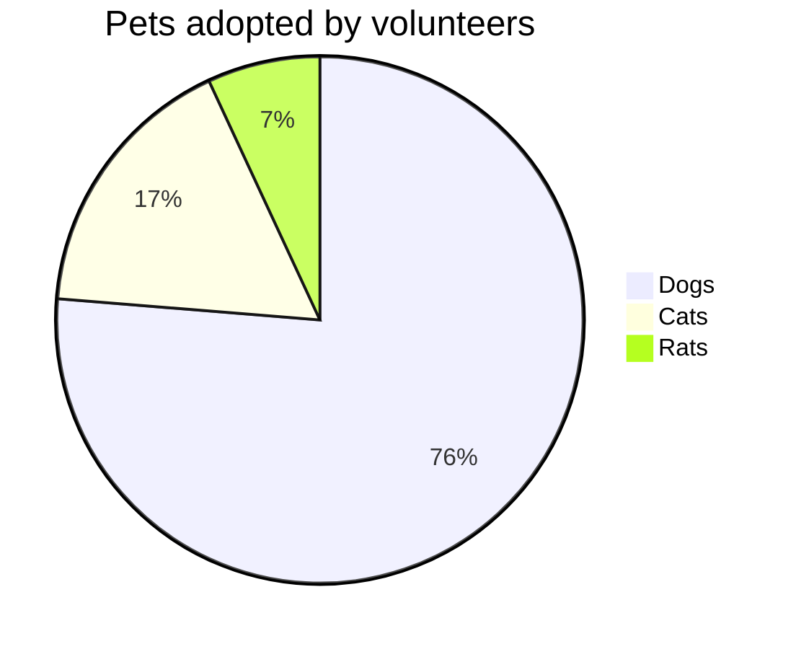

Hello world. Let's hack the planet.  
你好世界
 
inline videos:  
<iframe src="//player.bilibili.com/player.html?aid=80433022&bvid=BV1GJ411x7h7&cid=137649199&p=1" scrolling="yes" border="yes" frameborder="yes" framespacing="0" allowfullscreen="true"> </iframe>

C code highlight:
 
#include <cstdio>

int main(void)
{
    printf("Hello world\n");

    return 0;
}


Python code highlight test:


#!/usr/bin/env python3

import random
from polynomial import Polynomial as poly
from phe import paillier

class Alice:

    def __init__(self, initSets=list(), gen_keys=True):

        self.priv   = None
        self.pub    = None
        self.sets   = initSets
        self.coeffs = None

        if gen_keys:
            """Alice生成公私密钥"""

            self.generate_keys()

        if len(self.sets) > 0:
            """Alice计算多项式系数矩阵"""

            p = poly(*self.sets)
            self.coeffs = p.getCoefficient()        # 获取系数矩阵

    def generate_keys(self):

        self.pub, self.priv = paillier.generate_paillier_keypair()

    def encryptSets(self):
        """Alice加密系数矩阵"""

        enc_sets = []
        for _ in self.coeffs:
            enc_sets.append(self.pub.encrypt(_))
        return enc_sets

    def Alice2Bob(self):
        return self.encryptSets()

    def decryptSets(self, end_result):

        return common

class Bob:

    def __init__(self, initSets=list()):

        self.sets = initSets

    def verify(self, enc_sets):

        n = len(enc_sets)
        result = []

        for s in self.sets:
            tmp = [pow(s, _) for _ in range(0, n)]

            multiplied = []
            for _ in zip(enc_sets, tmp):
                multiplied.append(_[0] * _[1])

            sum_ = multiplied[0]
            for _ in multiplied[1:]:
                sum_ += _

            result.append(sum_)
        return result

    def lookup(self, *index):
        values = []
        for _ in index:
            values.append(self.sets[_])

        return values

if __name__ == "__main__":
    alice_set = [0, 7, 9, 25, 31, 44, 39, 67, 10, 84, 93, 26, 14, 3, 21]
    bob_set = [9, 7, 25, 4, 24, 18, 39, 44, 32, 13, 55, 69, 96, 71, 38, 46, 64, 21]

    print("Alice集合", alice_set)
    print("Bob集合", bob_set)
    a = Alice(alice_set)
    b = Bob(bob_set)

    decrypted = a.decryptSets(b.verify(a.Alice2Bob()))
    index = []
    for _ in range(len(decrypted)):
        if decrypted[_] == 0:
            index.append(_)

    print("求得交集:", end="")
    for _ in b.lookup(*index):
        print(" "+str(_), end="")
    print()


mermaid test code:

Tables support:  
|--|--|--|--|--|--|--|--|  
|♜| |♝|♛|♚|♝|♞|♜|  
| |♟|♟|♟| |♟|♟|♟|  
|♟| |♞| | | | | |  
| |♗| | |♟| | | |  
| | | | |♙| | | |  
| | | | | |♘| | |  
|♙|♙|♙|♙| |♙|♙|♙|  
|♖|♘|♗|♕|♔| | |♖|  

MathJax:  
$ \int\_a^b f(x)\,dx. $  

Custom table:
{:color-style: style="background: black;"}
{:color-style: style="color: white;"}
{:text-style: style="font-weight: 800; text-decoration: underline;"}

|:             Here's an Inline Attribute Lists example                :||||
| ------- | ------------------ | -------------------- | ------------------ |
|:       :|:  
 &lt; Normal HTML Block > 
 :|||
| ^^      |   Red    {: .cls style="background: orange" }                |||
| ^^ IALs |   Green  {: #id style="background: green; color: white" }    |||
| ^^      |   Blue   {: style="background: blue; color: white" }         |||
| ^^      |   Black  {: color-style text-style }                         |||
